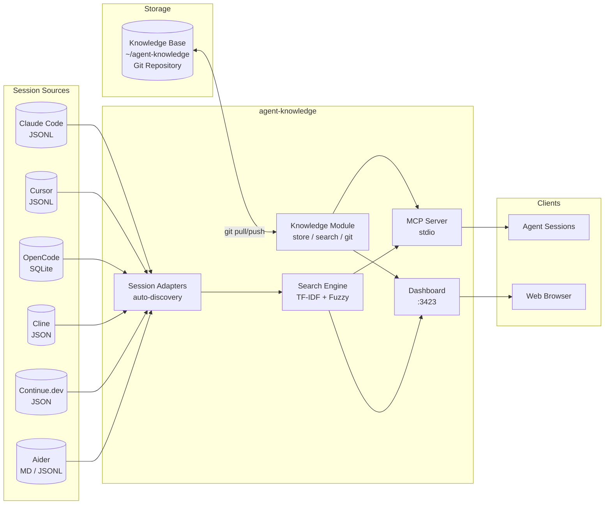

# agent-knowledge

[](LICENSE)
[](https://nodejs.org)
[]()
[]()
[]()

**Cross-session memory and recall for AI coding assistants** -- works with Claude Code, Cursor, OpenCode, Cline, Continue.dev, and Aider out of the box. Git-synced knowledge base, hybrid semantic+TF-IDF search, auto-distillation with secrets scrubbing.

**Benchmark:** **R@5 = 97.2% (sparse) / 98.8% (hybrid)** on `longmemeval_s` and **86.0% (sparse) / 88.4% (hybrid)** on the harder `longmemeval_m` split — the public LongMemEval academic benchmark (Wu et al. 2024, ICLR 2025), full 500 questions per split, no LLM, no API key, runs entirely offline. **+8.6pp to +13.2pp R@5 over the paper's official `flat-bm25` baseline** in apples-to-apples reproduction. Full per-category table, reproduction instructions, and paper-comparison details in [`bench/README.md`](bench/README.md).

<table>
<tr>
<td></td>
<td></td>
</tr>
<tr>
<td align="center"><em>Knowledge base with category filtering</em></td>
<td align="center"><em>TF-IDF ranked session search</em></td>
</tr>
</table>

## Why

AI coding sessions are ephemeral. When a session ends, everything it learned -- architecture decisions, debugging insights, project context -- is gone. The next session starts from scratch.

**agent-knowledge** solves this with two complementary systems:

1. **Knowledge Base** -- a git-synced markdown vault of structured entries (decisions, workflows, project context) that persists across sessions and machines.
2. **Session Search** -- TF-IDF ranked full-text search across session transcripts from all your coding tools, so agents can recall what happened before -- regardless of which tool was used.

## Supported Tools

Sessions from all major AI coding assistants are auto-discovered -- if a tool is installed, its sessions appear automatically.

| Tool             | Format         | Auto-detected path                                              |
| ---------------- | -------------- | --------------------------------------------------------------- |
| **Claude Code**  | JSONL          | `$KNOWLEDGE_DATA_DIR/projects/` (default `~/.claude/projects/`) |
| **Cursor**       | JSONL          | `~/.cursor/projects/*/agent-transcripts/`                       |
| **OpenCode**     | SQLite         | `~/.local/share/opencode/opencode.db` (or `$OPENCODE_DATA_DIR`) |
| **Cline**        | JSON           | VS Code globalStorage `saoudrizwan.claude-dev/tasks/`           |
| **Continue.dev** | JSON           | `~/.continue/sessions/`                                         |
| **Aider**        | Markdown/JSONL | `.aider.chat.history.md` / `.aider.llm.history` in project dirs |

No configuration needed. Additional session roots can be added via the `EXTRA_SESSION_ROOTS` env var (comma-separated paths).

## Features

- **Multi-tool session search** -- unified search across Claude Code, Cursor, OpenCode, Cline, Continue.dev, and Aider sessions
- **Hybrid search** -- semantic vector similarity blended with TF-IDF keyword ranking
- **Git-synced knowledge base** -- markdown vault with YAML frontmatter, auto commit and push on writes
- **Auto-distillation** -- session insights automatically extracted and pushed to git with secrets scrubbing
- **Pluggable adapter system** -- add support for new tools by implementing the `SessionAdapter` interface
- **Embeddings** -- local (Hugging Face), OpenAI, Claude/Voyage, or Gemini providers
- **Fuzzy matching** -- typo-tolerant search using Levenshtein distance
- **6 search scopes** -- errors, plans, configs, tools, files, decisions
- **6 MCP tools** -- consolidated action-based interface (knowledge, knowledge_search, knowledge_session, knowledge_graph, knowledge_analyze, knowledge_admin)
- **Wakeup context (L0+L1)** -- `knowledge` action `wakeup` returns a token-budgeted identity + top-weight entries blob for session-start hydration
- **Code graph resolution** -- `calls`, `imports`, `inherits` edge types for code structure; directed BFS traversal (`outbound`/`inbound`/`both`); `bulk_link` for efficient ingestion; `unlink_by_origin` for clearing stale code edges before re-ingest; `code:` prefixed node IDs distinguish code from knowledge
- **Temporal knowledge graph** -- edges support `valid_from` / `valid_to` validity windows; `as_of` queries return point-in-time snapshots; `invalidate` action marks facts as ended without deleting them
- **Hybrid scoring boosts** -- proper-noun and temporal-proximity boosts on top of TF-IDF + semantic blend, capped at +66.7%, short-circuit when no signals are present
- **Category as boost (not filter)** -- opt into `category_mode: "boost"` so a wrong category guess down-ranks instead of discarding the right answer
- **Verbatim session indexing** -- per-message chunks (≥30 chars) embedded into the vector store so raw conversation is retrievable; toggle with `KNOWLEDGE_INDEX_VERBATIM=false`
- **Configurable git URL** -- `knowledge_admin(action: "config")` for runtime setup, persisted at XDG/AppData location
- **Cross-machine persistence** -- knowledge syncs via git, sessions read from local storage of each tool
- **Real-time dashboard** -- browse, search, and manage at `localhost:3423`
- **Secrets scrubbing** -- API keys, tokens, passwords, private keys automatically redacted before git push
- **Knowledge graph** -- relationship edges between entries (related_to, supersedes, depends_on, contradicts, specializes, part_of, alternative_to, builds_on) with BFS traversal
- **Confidence/decay scoring** -- entries scored by access frequency and recency; auto-promotion from candidate to established to proven
- **Memory consolidation** -- TF-IDF duplicate detection on write (warns of similar entries) plus `knowledge_analyze(action: "consolidate")` for batch dedup scanning
- **Reflection cycle** -- `knowledge_analyze(action: "reflect")` surfaces unconnected entries and generates structured prompts for the agent to identify new graph connections
- **Auto-linking on write** -- new entries automatically linked to top-3 similar existing entries when cosine similarity > 0.7
- **Confidence metadata** — entries tagged `extracted` (user-written) or `inferred` (auto-distilled, 0.85× search rank multiplier); `confidence_score` field carries the model's certainty 0-1
- **Knowledge analysis** — `knowledge_analyze` actions `god_nodes` (most-connected entries), `bridges` (cross-category connectors), `gaps` (isolated entries)
- **Knowledge brief** — `knowledge_analyze(action: "brief")` returns a cached ~200 token summary (core concepts, active projects, recent decisions, stale and gap counts) for session-start orientation
- **Edge provenance** — graph edges track `origin` (manual, auto-link, distill, reflect) so analysis can distinguish user judgment from automated heuristics
- **Deterministic pre-extraction in distillation** — session summaries now include git commits, error patterns, URLs accessed, and packages changed extracted via regex from bash/tool output (no LLM cost)

## Codebase Ingestion

The **knowledge-ingest** skill populates or updates the knowledge base from a codebase directory. It uses tree-sitter for zero-token structural extraction (classes, functions, imports, call graphs, rationale comments), then clusters files into subsystems and creates knowledge entries + graph edges via existing MCP tools. Subsequent runs are incremental — only changed files are reprocessed.

```
/knowledge-ingest ./my-project
```

Uses the [Agent Skills standard](https://agentskills.io) — works with Claude Code, OpenCode, Cursor, Codex CLI, and Gemini CLI. See [Ingestion Guide](docs/INGEST.md) for details.

**Supported languages:** TypeScript, JavaScript, Python, Go, Rust, Java, C, C++.

## Quick Start

### Install from npm

```bash
npm install -g agent-knowledge
```

### Or clone from source

```bash
git clone https://github.com/keshrath/agent-knowledge.git
cd agent-knowledge
npm install && npm run build
```

### Option 1: MCP server (for AI agents)

Add to your MCP client config (Claude Code, Cline, etc.):

```json
{
  "mcpServers": {
    "agent-knowledge": {
      "command": "npx",
      "args": ["agent-knowledge"]
    }
  }
}
```

The dashboard auto-starts at http://localhost:3423 on the first MCP connection.

See [Setup Guide](docs/SETUP.md) for client-specific instructions (Claude Code, Cursor, Windsurf, OpenCode).

### Option 2: Standalone server (for REST/WebSocket clients)

```bash
node dist/server.js --port 3423
```

## MCP Tools (6)

### Knowledge Base

| Tool        | Action   | Description                         | Parameters                                       |
| ----------- | -------- | ----------------------------------- | ------------------------------------------------ |
| `knowledge` | `list`   | List entries by category and/or tag | `category?`, `tag?`                              |
|             | `read`   | Read a specific entry               | `path` (required)                                |
|             | `write`  | Create/update entry (auto git sync) | `category`, `filename`, `content` (all required) |
|             | `delete` | Delete an entry (auto git sync)     | `path` (required)                                |
|             | `sync`   | Manual git pull + push              | --                                               |

### Search

| Tool               | Description                                     | Parameters                                              |
| ------------------ | ----------------------------------------------- | ------------------------------------------------------- |
| `knowledge_search` | Hybrid semantic + TF-IDF search across sessions | `query`, `project?`, `role?`, `max_results?`, `ranked?` |
|                    | Scoped recall (when `scope` is provided)        | `query`, `scope`, `project?`, `max_results?`            |

Scopes: `errors`, `plans`, `configs`, `tools`, `files`, `decisions`, `all`.

### Sessions

| Tool                | Action    | Description                            | Parameters                                          |
| ------------------- | --------- | -------------------------------------- | --------------------------------------------------- |
| `knowledge_session` | `list`    | List sessions with metadata            | `project?`                                          |
|                     | `get`     | Retrieve full session conversation     | `session_id`, `project?`, `include_tools?`, `tail?` |
|                     | `summary` | Session summary (topics, tools, files) | `session_id`, `project?`                            |

### Knowledge Graph

| Tool              | Action             | Description                               | Parameters                                                        |
| ----------------- | ------------------ | ----------------------------------------- | ----------------------------------------------------------------- |
| `knowledge_graph` | `link`             | Create/update edge between entries        | `source`, `target`, `rel_type`, `strength?`                       |
|                   | `unlink`           | Remove edges between entries              | `source`, `target`, `rel_type?`                                   |
|                   | `invalidate`       | Mark edges as expired (set valid_to)      | `source`, `target`, `rel_type?`, `valid_to?`                      |
|                   | `list`             | List edges                                | `entry?`, `rel_type?`, `as_of?`                                   |
|                   | `traverse`         | Directed BFS traversal from an entry      | `entry`, `depth?`, `direction?`, `rel_type?`, `as_of?`            |
|                   | `bulk_link`        | Batch-create edges (code graph ingestion) | `edges` (array of {source, target, rel_type, strength?, origin?}) |
|                   | `unlink_by_origin` | Delete all edges by origin                | `origin`                                                          |

**Knowledge types**: `related_to`, `supersedes`, `depends_on`, `contradicts`, `specializes`, `part_of`, `alternative_to`, `builds_on`
**Code structure types**: `calls`, `imports`, `inherits`

**Traverse directions**: `outbound` (source→target), `inbound` (target→source), `both` (default, undirected)

### Analysis

| Tool                | Action        | Description                                | Parameters                  |
| ------------------- | ------------- | ------------------------------------------ | --------------------------- |
| `knowledge_analyze` | `consolidate` | Find near-duplicate entries                | `category?`, `threshold?`   |
|                     | `reflect`     | Find unconnected entries for linking       | `category?`, `max_entries?` |
|                     | `god_nodes`   | Most-connected entries (degree centrality) | `top_n?`                    |
|                     | `bridges`     | Cross-category connectors (betweenness)    | `top_n?`                    |
|                     | `gaps`        | Isolated entries (0-1 edges) by maturity   | `max_entries?`              |
|                     | `brief`       | Cached ~200 token knowledge base summary   | --                          |

### Admin

| Tool              | Action   | Description                  | Parameters                                 |
| ----------------- | -------- | ---------------------------- | ------------------------------------------ |
| `knowledge_admin` | `status` | Vector store statistics      | --                                         |
|                   | `config` | View or update configuration | `git_url?`, `memory_dir?`, `auto_distill?` |

## REST API

| Method | Endpoint                                | Description                |
| ------ | --------------------------------------- | -------------------------- |
| GET    | `/api/knowledge`                        | List knowledge entries     |
| GET    | `/api/knowledge/search?q=`              | Search knowledge base      |
| GET    | `/api/knowledge/:path`                  | Read a specific entry      |
| GET    | `/api/knowledge/god-nodes?top_n=`       | Most-connected entries     |
| GET    | `/api/knowledge/bridges?top_n=`         | Cross-category connectors  |
| GET    | `/api/knowledge/gaps?max_entries=`      | Isolated entries           |
| GET    | `/api/knowledge/brief`                  | Knowledge base brief       |
| GET    | `/api/sessions`                         | List sessions              |
| GET    | `/api/sessions/search?q=&role=&ranked=` | Search sessions (TF-IDF)   |
| GET    | `/api/sessions/recall?scope=&q=`        | Scoped recall              |
| GET    | `/api/sessions/:id`                     | Read a session             |
| GET    | `/api/sessions/:id/summary`             | Session summary            |
| POST   | `/api/knowledge`                        | Write entry (HTTP clients) |
| GET    | `/health`                               | Health check               |

## Architecture



## Knowledge Graph

Entries and code symbols can be connected via typed, weighted edges stored in a dedicated `edges` SQLite table. Eleven relationship types are supported — 8 for knowledge edges and 3 for code structure:

**Knowledge**: `related_to`, `supersedes`, `depends_on`, `contradicts`, `specializes`, `part_of`, `alternative_to`, `builds_on`
**Code structure**: `calls`, `imports`, `inherits`

- **`knowledge_graph(action: "link")`** creates or updates an edge (with optional strength 0-1)
- **`knowledge_graph(action: "unlink")`** removes edges (optionally filtered by type)
- **`knowledge_graph(action: "list")`** lists edges for an entry or relationship type
- **`knowledge_graph(action: "traverse")`** performs directed BFS traversal from a starting entry. Supports `direction` (`outbound`, `inbound`, `both`) and `rel_type` filter
- **`knowledge_graph(action: "bulk_link")`** batch-creates edges in a single transaction (for code graph ingestion)
- **`knowledge_graph(action: "unlink_by_origin")`** deletes all edges with a specific origin (for clearing stale code edges before re-ingest)

### Code Graph

Code structure edges are created by the `knowledge-ingest` skill during codebase ingestion. They use `code:` prefixed node IDs:

```
code:src/auth/middleware.ts                    # file node
code:src/auth/middleware.ts::validateToken      # symbol node
```

Query examples:

```
# Who calls validateToken?
knowledge_graph({ action: "traverse", entry: "code:src/auth.ts::validateToken", direction: "inbound", rel_type: "calls", depth: 3 })

# What breaks if I change this function?
knowledge_graph({ action: "traverse", entry: "code:src/auth.ts::validateToken", direction: "inbound", rel_type: "calls", depth: 5 })

# Combined: callers + knowledge context (decisions, design rationale)
knowledge_graph({ action: "traverse", entry: "code:src/auth.ts::validateToken", depth: 2 })
```

### Auto-linking

When `knowledge` with `action: "write"` creates or updates an entry, it automatically finds the top-3 most similar existing entries via cosine similarity and creates `related_to` edges for any pair scoring above 0.7.

## Confidence & Decay Scoring

Each knowledge entry has a confidence score tracked in the `entry_scores` SQLite table. Search results are ranked using:

```
finalScore = baseRelevance * 0.5^(daysSinceLastAccess / 90) * maturityMultiplier
```

Entries mature automatically based on access count:

| Stage         | Accesses | Multiplier |
| ------------- | -------- | ---------- |
| `candidate`   | < 5      | 0.5x       |
| `established` | 5-19     | 1.0x       |
| `proven`      | 20+      | 1.5x       |

Frequently accessed entries rise in search rankings; stale entries decay over time.

## Search Capabilities

**TF-IDF Ranking** -- results scored by term frequency-inverse document frequency. Rare terms boost relevance. Global index cached for 60 seconds.

**Fuzzy Matching** -- Levenshtein edit distance with sliding window. Configurable threshold (default 0.7).

**Scoped Recall** via `knowledge_search` with the `scope` parameter:

| Scope       | Matches                                   |
| ----------- | ----------------------------------------- |
| `errors`    | Stack traces, exceptions, failed commands |
| `plans`     | Architecture, TODOs, implementation steps |
| `configs`   | Settings, env vars, configuration files   |
| `tools`     | MCP tool calls, CLI commands              |
| `files`     | File paths, modifications                 |
| `decisions` | Trade-offs, rationale, choices            |

## Integrations

### REST Write Endpoint

`POST /api/knowledge` accepts `{ category, filename, content }` and runs the full write pipeline: git pull → file write → embedding index → auto-link → git push → duplicate check. Returns `{ path, autoLinks?, duplicateWarnings?, git }` with status 201.

This enables HTTP-based writes from other services without an MCP connection.

### agent-tasks KnowledgeBridge

[agent-tasks](https://github.com/keshrath/agent-tasks) has a built-in `KnowledgeBridge` that auto-pushes `learning` and `decision` artifacts to agent-knowledge on task completion. Entries land in `decisions/` with frontmatter tags (`agent-tasks`, project name, artifact type), are auto-indexed with embeddings, and auto-linked to similar entries. No configuration needed — if agent-knowledge is running at `localhost:3423`, it works.

## Testing

```bash
npm test              # 352 tests across 20 files
npm run test:watch    # Watch mode
npm run lint          # Type-check (tsc --noEmit)
```

## Environment Variables

| Variable                                            | Default             | Description                                                           |
| --------------------------------------------------- | ------------------- | --------------------------------------------------------------------- |
| `KNOWLEDGE_MEMORY_DIR`                              | `~/agent-knowledge` | Path to git-synced knowledge base                                     |
| `KNOWLEDGE_GIT_URL`                                 | --                  | Git remote URL (auto-clones if dir missing)                           |
| `KNOWLEDGE_AUTO_DISTILL`                            | `true`              | Auto-distill session insights to knowledge base                       |
| `KNOWLEDGE_EMBEDDING_PROVIDER`                      | `local`             | Embedding provider: `local`, `openai`, `claude`, `gemini`             |
| `KNOWLEDGE_EMBEDDING_ALPHA`                         | `0.3`               | TF-IDF vs semantic blend weight (0=pure semantic, 1=pure TF-IDF)      |
| `KNOWLEDGE_EMBEDDING_IDLE_TIMEOUT`                  | `60`                | Seconds before unloading local model from memory (0 = keep alive)     |
| `KNOWLEDGE_DATA_DIR`                                | `~/.claude`         | Primary session data directory (Claude Code JSONL files)              |
| `EXTRA_SESSION_ROOTS`                               | --                  | Additional session directories, comma-separated paths                 |
| `OPENCODE_DATA_DIR`                                 | (see below)         | Override OpenCode data directory (default: `~/.local/share/opencode`) |
| `KNOWLEDGE_ANTHROPIC_API_KEY` / `ANTHROPIC_API_KEY` | --                  | API key for Claude/Voyage embeddings                                  |
| `KNOWLEDGE_PORT`                                    | `3423`              | Dashboard HTTP port                                                   |

## Documentation

- [Setup Guide](docs/SETUP.md) — installation, client setup (Claude Code, OpenCode, Cursor, Windsurf), hooks, skills
- [Ingestion Guide](docs/INGEST.md) — codebase ingestion skill, tree-sitter extraction, incremental updates
- [Architecture](docs/ARCHITECTURE.md) — source structure, design principles, database schema
- [Dashboard](docs/DASHBOARD.md) — web UI views and features
- [Changelog](CHANGELOG.md)

## License

[MIT](LICENSE)
